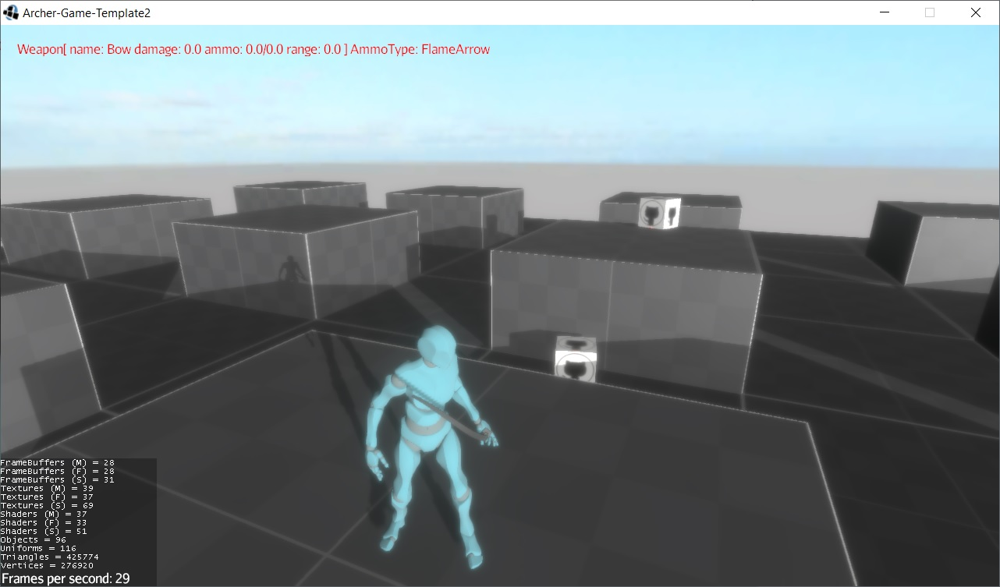
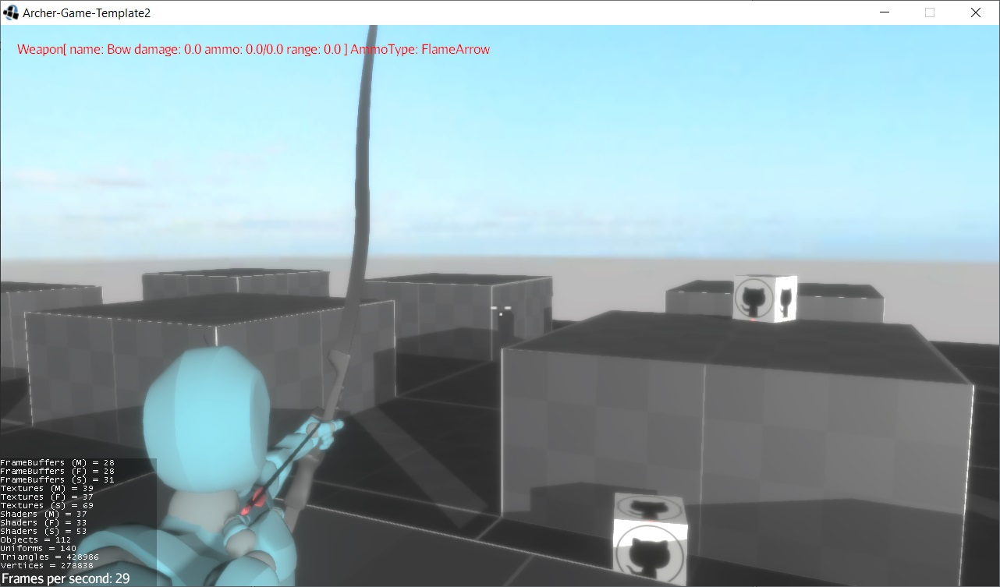

# Archer-Game-Template 2
A Third Person Shooter demo made with [jMonkeyEngine](https://jmonkeyengine.org/)

The demo contains:

* Physics with [Minie](https://stephengold.github.io/Minie/minie/overview.html)
* Arrows are now physical objects affected by gravity with trajectory prediction
* There are 3 types of arrows:
  - normal (The normal arrows stick to surfaces)
  - explosive
  - acid
* A [materialize](https://store.jmonkeyengine.org/13e64183-01fb-4511-88a8-f6958f95a2c2) shader that simulates “materializing” an object in or out.
* Animations (with gltf2 animations, file .blend included): 
    * "Idle", "Running", "Running_2", "Aim_Idle", "Aim_Overdraw", "Aim_Recoil", "Draw_Arrow", "Water_Idle", "Water_Moving", "Swimming"
* Third Person Camera with collision detection
* Dynamic update of camera FOV when aiming
* Keyboard/Mouse support
* Joystick support

# Youtube videos
[Demo](https://www.youtube.com/watch?v=US9KNTqL2js&feature=emb_logo)

# Keyboard Commands
(see file [GInputAppState](https://github.com/capdevon/Archer-Game-Template2/blob/main/src/main/java/com/capdevon/input/GInputAppState.java) for all configurations, joystick included)
- WASD: Basic movements
- E: Aiming
- R: Switch arrow type
- LMB: Left Mouse Button to fire
- LSHIFT: Running
- CAMERA: Use the mouse to orient the camera
- KEY_0: Toggle Physics Debug

# Resource Used
- [Mixamo](https://www.mixamo.com/)
- [Blender](https://www.blender.org/download/)

# 

